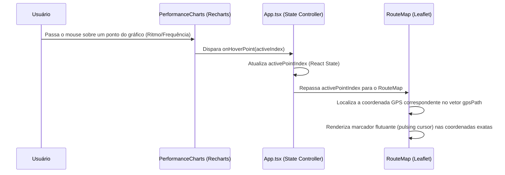

# FITParse Analyzer - Documentação Completa do Sistema

FITParse Analyzer é um ecossistema Web App responsivo projetado para importar, analisar e arquivar dados telemétricos e biomecânicos de arquivos de treino `.fit` gerados por smartwatches, com foco especial nos dispositivos **Amazfit (como GTR 3 via Zepp App)** e **Garmin**.

O sistema realiza parsing avançado da estrutura bruta de arquivos FIT (incluindo metadados proprietários do desenvolvedor e sub-modalidades esportivas), calcula dinamicamente eficiência de passada e riscos de lesões, fornece mapas interativos com sincronização de cursor com gráficos telemétricos e mantém um histórico completo de longo prazo dos treinos do usuário.

---

## 📌 Arquitetura do Ecossistema

O projeto foi desenvolvido em uma estrutura monorepo dividida em três pilares principais:

```
Amazfit/
├── app/
│   ├── backend/                # API FastAPI + Parser de Arquivos FIT
│   │   ├── main.py             # Rotas e controladores da API
│   │   ├── fit_processor.py    # Algoritmo de parsing baseado no python-fitparse e Pandas
│   │   ├── models.py           # Esquemas do banco de dados (SQLAlchemy) com tratamento de NaN
│   │   ├── database.py         # Configuração de conexão e fallback automático (SQLite/PostgreSQL)
│   │   └── requirements.txt    # Dependências do Python (fitparse, pandas, sqlalchemy, etc.)
│   └── frontend/               # Single Page Application React (TypeScript + Vite)
│       ├── src/
│       │   ├── App.tsx         # Fluxo principal e gerência de estados (Dual-View)
│       │   ├── components/     # Componentes visuais customizados (Recharts + Leaflet)
│       │   └── index.css       # Estilização CSS vanilla premium (Dark Mode)
└── k8s/                        # Manifestos de Implantação Kubernetes (PostgreSQL, Backend, Frontend)
```

---

## ⚙️ Core Backend & Motor de Parsing (`fit_processor.py`)

O processamento é feito pela classe `FitProcessor` no backend Python. Ele utiliza o pacote `python-fitparse` para converter a estrutura binária em DataFrames do `pandas` para análises estatísticas estruturadas.

### 1. Mensagens FIT Processadas
O parser analisa as mensagens em baixo nível para extrair informações cruciais:
*   `file_id`: Marca, modelo do dispositivo gravador e timestamp de criação do arquivo.
*   `developer_data_id`: Identificação dos dados customizados do aplicativo parceiro (ex: Zepp App).
*   `field_description`: Definição de mapeamentos para atributos extras injetados pelos desenvolvedores de aplicativos.
*   `device_info`: Logs de bateria, transmissores de sensores de FC e informações de hardware.
*   `record`: Amostragens de segundo a segundo (latitude, longitude, altitude, frequência cardíaca, velocidade e cadência).
*   `lap`: Estatísticas por volta ou intervalo programado de corrida.
*   `session`: O consolidado final do treino (distâncias totais, tempos acumulados, zonas fisiológicas, cargas e efeitos de treino).

### 2. Algoritmos de Interpolação de Voltas (Laps)
Muitos gravadores não preenchem as estatísticas consolidadas nas mensagens `lap` (ex: velocidade média, FC máxima da volta). O `FitProcessor` detecta laps incompletos e executa uma interpolação baseada no tempo, extraindo a janela temporal correspondente no DataFrame `record` para calcular médias e picos reais com exatidão.

### 3. Cálculos Biomecânicos e Estimativas
*   **Cadência (SPM)**: O valor bruto registrado no sensor de cadência do relógio representa as rotações por minuto de apenas um pé. Multiplica-se por 2 para se obter os passos por minuto (*Steps Per Minute - SPM*).
*   **Comprimento de Passada (Stride Length)**: Calculado dinamicamente para cada ponto da série temporal através da velocidade instantânea ($v$ em m/s) e cadência instantânea ($c$ em passos/s):
$$\text{Passada (mm)} = \frac{v}{c} \times 1000$$
Se a cadência for zero, o comprimento é padronizado em zero.
*   **Estimativa de Passos Totais**: Integrado ao longo do tempo multiplicando a cadência média pela duração ativa do treino.

### 4. Tratamento de Erros de NaN/Inf (`models.py`)
Métricas nulas em pandas geram valores `float('nan')` ou `float('inf')` que são rejeitados pelo serializador de JSON do FastAPI (que segue a especificação rigorosa da RFC 7159). Para mitigar isso, o modelo define a função `sanitize_json_values(val)`, que varre recursivamente dicionários, listas e tuplas, convertendo valores numéricos inválidos em `None` (representado como `null` no JSON final do frontend).

---

## 📡 API Endpoints Reference

A API FastAPI é assíncrona, operando na porta `8000`.

### 📂 Upload de Treinos
*   `POST /api/upload`: Envia um arquivo único `.fit`. Retorna o objeto JSON da atividade recém-criada.
*   `POST /api/upload/batch`: Aceita múltiplos arquivos `.fit` ou um arquivo compilado `.zip` contendo vários treinos. Extrai e processa em segundo plano, retornando o balanço de sucessos, falhas e arquivos ignorados.

### 📊 Consulta e Listagem
*   `GET /api/activities`: Retorna uma lista leve de todas as atividades salvas no banco (usado para popular a tabela do histórico), omitindo as séries temporais densas de GPS para performance de banda.
*   `GET /api/activities/{id}`: Retorna a estrutura JSON completa de um treino específico, contendo todo o vetor GPS, séries de dados temporais para gráficos e análises biomecânicas.
*   `DELETE /api/activities/{id}`: Remove permanentemente uma atividade física da base de dados.
*   `GET /api/activities/stats/summary`: Calcula e agrupa dados históricos em agregados de longo prazo (volume em km agrupado por mês, evolução do ritmo médio e tendências de batimentos cardíacos mínimos, médios e máximos).

---

## 🎨 Interface do Usuário (Frontend React)

O painel é desenhado com CSS vanilla responsivo usando conceitos de *glassmorphism*, gradientes vibrantes e um tema escuro (Dark Mode) profissional de alto padrão. Ele divide-se em duas visualizações controladas por estado (`viewMode`):

### 1. Painel de Histórico (`HistoryDashboard.tsx`)
Apresenta os seguintes recursos ao usuário:
*   **Métricas Acumuladas**: Volume Total (km), Tempo Acumulado, Passos Acumulados e Atividades Gravadas.
*   **Abas de Gráficos de Tendência**:
    1.  **Distância Mensal**: Gráfico de barras (`BarChart` do Recharts) ilustrando o volume corrido por mês.
    2.  **Evolução do Ritmo**: Gráfico de linha invertido mostrando a evolução do pace médio (min/km).
    3.  **Frequência Cardíaca**: Gráfico com múltiplas linhas mapeando a variação dos batimentos cardíacos médios e limites máximos ao longo do tempo.
*   **Tabela de Atividades**: Listagem com data, tipo de esporte, distância, tempo, ritmo e carga de treino (`training_load`), com botões rápidos de exclusão permanente (`DELETE`) ou visualização detalhada.

### 2. Dashboard de Telemetria e Biomecânica (`App.tsx` + Componentes)
Mapeia a atividade carregada por meio de widgets especializados:
*   **RouteMap (Mapa Leaflet)**: Traça a rota georreferenciada utilizando a API OpenStreetMap.
*   **PerformanceCharts (Gráficos Dinâmicos)**: Apresenta cinco cards dedicados de desempenho com gradientes harmoniosos: **Ritmo**, **Frequência Cardíaca**, **Altitude**, **Cadência** e **Comprimento de Passada**.
*   **BiomechInsightsWidget (Métricas Clínicas)**: Compara a cadência e comprimento de passada do corredor. Se o ritmo médio for baixo mas o comprimento de passada for excessivamente longo, o widget emite alertas em português contra *Overstriding* (risco aumentado de lesões no joelho/quadril por pisar à frente do centro de gravidade).
*   **HeartRateZones (Zonas Cardíacas)**: Gráfico de barras horizontais indicando a quantidade de tempo e porcentagem gasta em cada uma das zonas fisiológicas (Z1 a Z5).
*   **PeakHrWidget & LapsTable**: Detalha o momento exato de maior esforço e exibe o resumo lap-a-lap do treino.

---

## 🔄 Fluxo de Sincronização Dinâmica (Hover Sync)

A comunicação em tempo real entre os gráficos de desempenho e o mapa foi desenvolvida para emular ferramentas premium de telemetria esportiva (como Strava e Garmin Connect):



---

## 💾 Camada de Persistência (PostgreSQL & SQLite Fallback)

O banco de dados é inicializado em `database.py`.
1.  **Ambiente Local/Desenvolvimento**: O backend busca a variável de ambiente `DATABASE_URL`. Se estiver ausente, inicializa uma instância SQLite autônoma e gera o arquivo físico `amazfit.db` no diretório de execução.
2.  **Ambiente de Produção (Kubernetes)**: Ao detectar a presença de uma conexão Postgres nos segredos do cluster, conecta-se ao banco PostgreSQL centralizado.
3.  **Tabelas Automáticas**: A inicialização automática de esquemas (`Base.metadata.create_all`) garante que as tabelas necessárias sejam criadas automaticamente na inicialização sem a necessidade de migrações manuais no primeiro boot.

---

## 🐳 Dockerização e Implantação Kubernetes (`k8s/`)

### 📦 Dockerfiles
Tanto o backend quanto o frontend possuem arquivos `Dockerfile` otimizados para produção:
*   **Backend**: Utiliza imagem base `python:3.12-slim` para compilar as dependências e expõe a porta `8000` via Uvicorn.
*   **Frontend**: Utiliza compilação multi-stage. O estágio 1 realiza o build do React via Vite/Node. O estágio 2 copia a pasta de saída `/dist` para uma imagem `nginx:alpine` leve e injeta uma configuração customizada de roteamento (`nginx.conf`) para tratar rotas do React Router e encaminhar requisições da API.

### ☸️ Recursos Kubernetes
A pasta `/k8s` contém a infraestrutura do cluster:
1.  **`postgres-deployment.yaml`**: Configura um banco de dados PostgreSQL persistente usando um volume físico (`PersistentVolumeClaim`).
2.  **`secrets.yaml`**: Armazena as chaves de credenciais codificadas em Base64 para comunicação segura do banco.
3.  **Deployments e Services**: Cria deployments replicados com probes de inicialização (`/api/health`) e expõe as rotas externas através de portas e serviços configurados.

---

## 🚀 Guia de Execução Local

Você pode iniciar e parar toda a aplicação de forma automatizada usando os scripts criados na raiz do projeto:

### Iniciar Aplicação
Para rodar tanto o frontend quanto o backend em segundo plano, execute:
```bash
./start.sh
```
Isso iniciará:
*   O Backend em `http://localhost:8000` (logs em `app/backend/backend.log`)
*   O Frontend em `http://localhost:5173` (logs em `app/frontend/frontend.log`)

### Parar Aplicação
Para interromper todos os serviços de segundo plano e liberar as portas utilizadas, execute:
```bash
./stop.sh
```

---

### Execução Manual Alternativa

Se preferir rodar cada serviço individualmente no terminal para acompanhar os logs em tempo real:

#### 1. Backend (FastAPI)
Navegue até a pasta do backend e inicie o servidor utilizando o python do ambiente virtual configurado:
```bash
cd app/backend
/home/dns/Desenvolvimento/Fit/.venv/bin/python main.py
```

#### 2. Frontend (React)
Navegue até a pasta do frontend, instale as dependências e inicie o servidor Vite:
```bash
cd app/frontend
npm install
npm run dev
```
